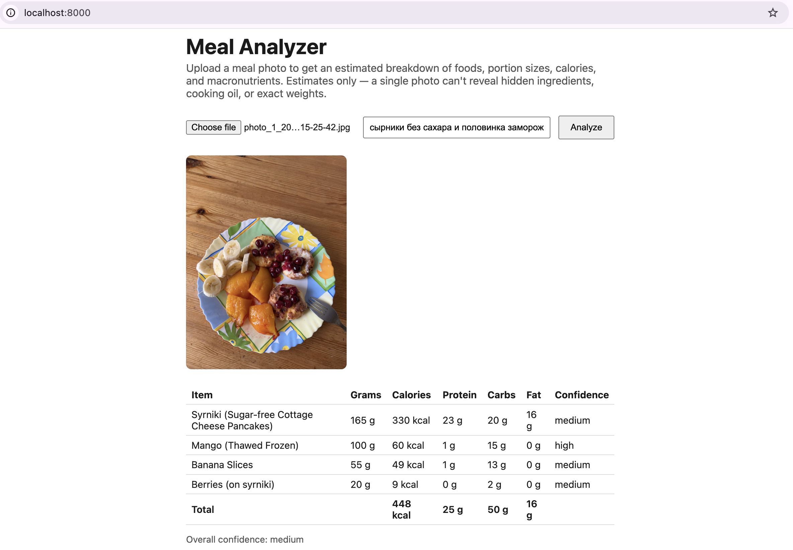

# meal-analyzer-mcp

An MCP server that analyzes a meal photo with a multimodal Gemini model and returns
structured nutrition data: detected foods, estimated portion sizes, calories, and
macronutrients.



## Tool

### `analyze_meal_image`

Analyze a meal photo and estimate detected foods, portion sizes, calories, and
macronutrients. Returns structured JSON. Estimates are based only on what's
visible in the image — hidden ingredients, cooking oils, sauces, and exact
weights cannot be determined from a single photo.

**Input**
- `image_base64` (string, required) — base64-encoded image data
- `mime_type` (string, required) — e.g. `image/jpeg`, `image/png`
- `context` (string, optional) — short additional context to help the model (e.g. recipe, ingredients used, known portion size)

**Output** (`MealAnalysis`)
```json
{
  "items": [
    {
      "name": "grilled chicken breast",
      "estimated_grams": 150,
      "calories": 250,
      "protein_g": 46,
      "carbs_g": 0,
      "fat_g": 6,
      "confidence": "medium"
    }
  ],
  "totals": {
    "calories": 250,
    "protein_g": 46,
    "carbs_g": 0,
    "fat_g": 6
  },
  "overall_confidence": "medium",
  "warnings": [
    "Portion size estimated visually",
    "Cooking oil may not be visible"
  ]
}
```

## Limitations

This tool produces an **estimate**, not a precise measurement. A single photo
cannot reveal hidden ingredients, cooking oil, sauces/dressings, or the exact
weight of a portion — treat calorie and macro figures as approximate, and rely
on the `warnings` and `confidence` fields to gauge how much to trust a given
result.

## Setup

Requires Python 3.10+ and a Gemini API key from
[Google AI Studio](https://aistudio.google.com/apikey).

```bash
python -m venv .venv
source .venv/bin/activate
pip install -e .
cp .env.example .env   # then fill in GEMINI_API_KEY
```

### Model

`GEMINI_MODEL` accepts any multimodal Gemini model name (the server does not
hard-code a specific version) — `gemini-2.5-flash` is just the shipped default.
Swap in `gemini-2.5-pro`, or a newer multimodal Gemini model, by changing the
env var.

## Running locally (stdio)

With `MCP_TRANSPORT` unset or set to `stdio`, the server communicates over
stdio — the standard way local MCP clients (Claude Desktop, Claude Code) launch
an MCP server as a subprocess.

Try it interactively with the MCP Inspector:

```bash
mcp dev src/meal_analyzer_mcp/server.py
```

To register it with Claude Desktop, add to `claude_desktop_config.json`:

```json
{
  "mcpServers": {
    "meal-analyzer": {
      "command": "meal-analyzer-mcp",
      "env": {
        "GEMINI_API_KEY": "..."
      }
    }
  }
}
```

## Running as a deployed server (Docker)

The server can also run over `streamable-http`, so it can be deployed to any
server/container host and reached over a URL rather than launched as a local
subprocess.

```bash
docker build -t meal-analyzer-mcp .
docker run -p 8000:8000 -e GEMINI_API_KEY=... meal-analyzer-mcp
```

or with `docker compose` (reads `GEMINI_API_KEY` etc. from `.env`):

```bash
docker compose up --build
```

This works on any container host — Fly.io, Cloud Run, ECS, or a plain VM
running `docker run`. Point an MCP client that supports remote/HTTP servers at
`http://<host>:8000`.

A simple browser UI (pictured above) is also bundled at `http://<host>:8000/`
in this mode — upload a photo, optionally add context, and see the structured
result without needing an MCP client.
